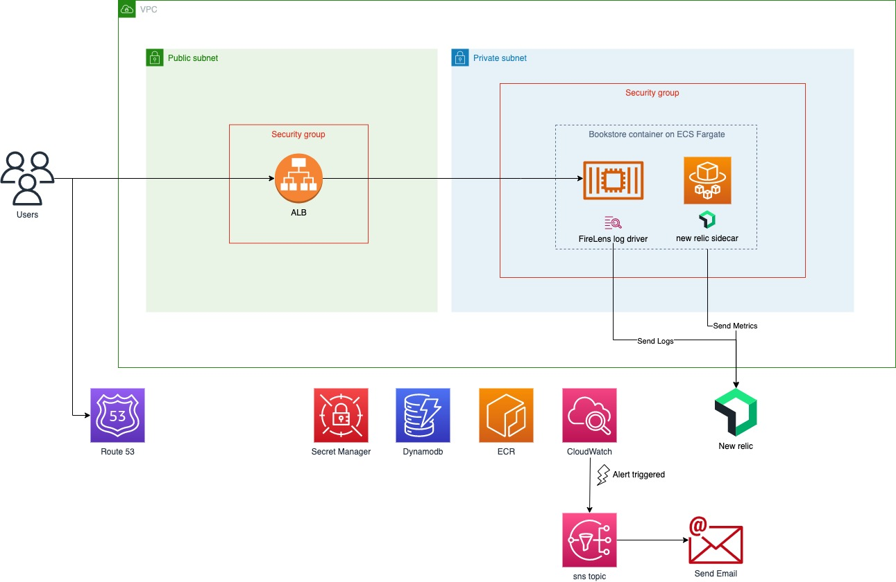

# Terraform Challenge

## Context
I made this repository as a response to a technical challenge in Terraform. 

The repository is divided into 2 an application part with the API code, and a Terraform part with the Infrastructure as a code.

## Application
The application is a simple express.js API that uses DynamoDB as a database, to list the catalogs of books available in a bookstore. You can check the list or add a new book to the list. 
There is a Dockerfile in the folder that will help you build your docker image.
## Terraform
This side in separated into 3 parts.
### Network
This terraforms folder contains the configuration of the VPC and the subnets, there are some VPC endpoints to let ECS access our future docker image stored in the ECR.
### Predeploy
This folder regroups ECR and Secret manager, these two components need to be prepared in advance before creation of our application. We need to upload our docker image to ECR and set our secrets in the secret manage.
### Application
This folder contains the main show. ECS, ALB and DynamoDB, I tried to split into modules as much as possible to keep everything clear and clean.

- I used the New relic agent and Firelens to send the metrics and logs to New relic
- Used CloudWatch to create alerts that send email when using too much CPU or memory
- Made a DNS record in a route53 zone.

### Architecture Diagram

